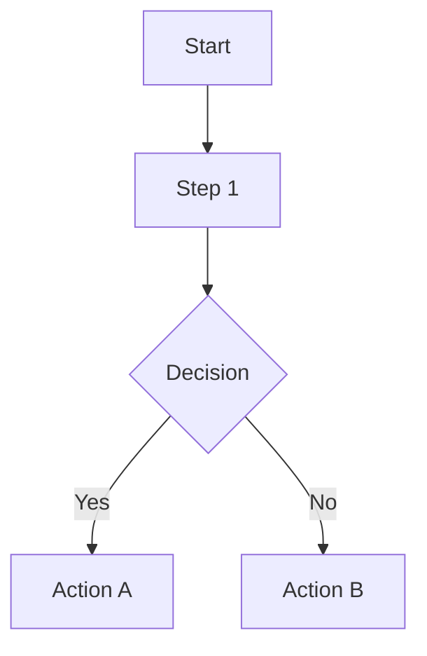
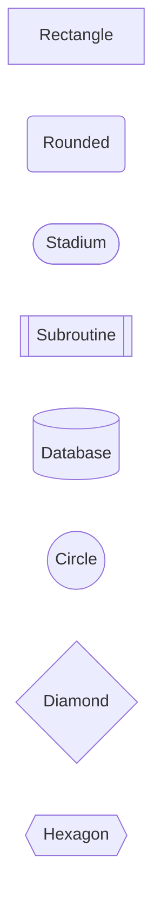
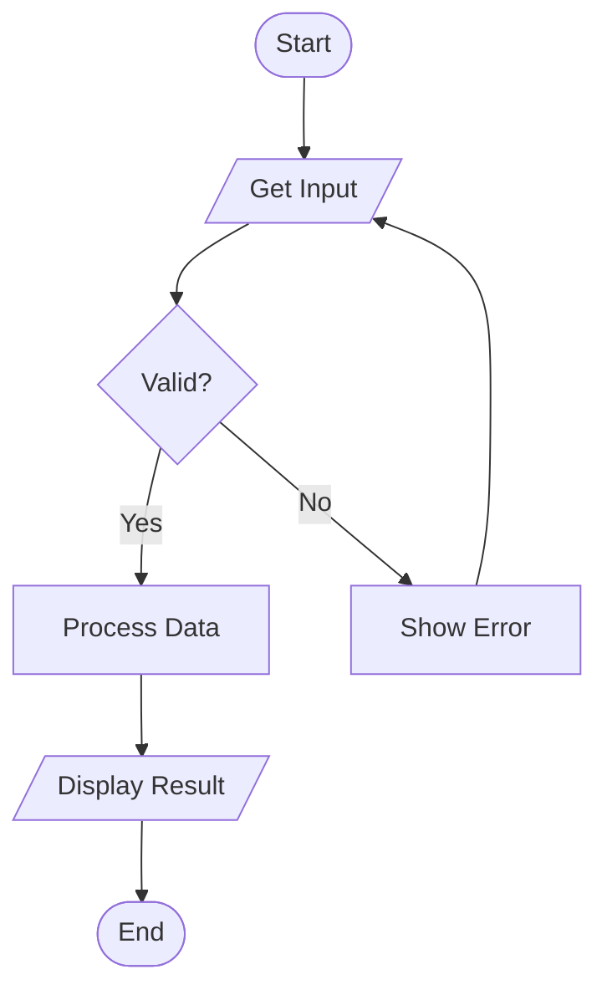
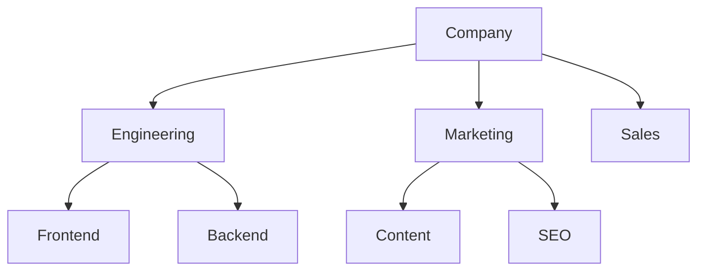
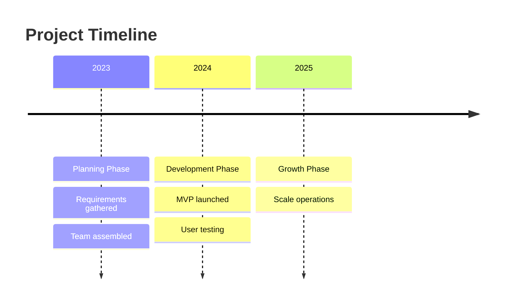
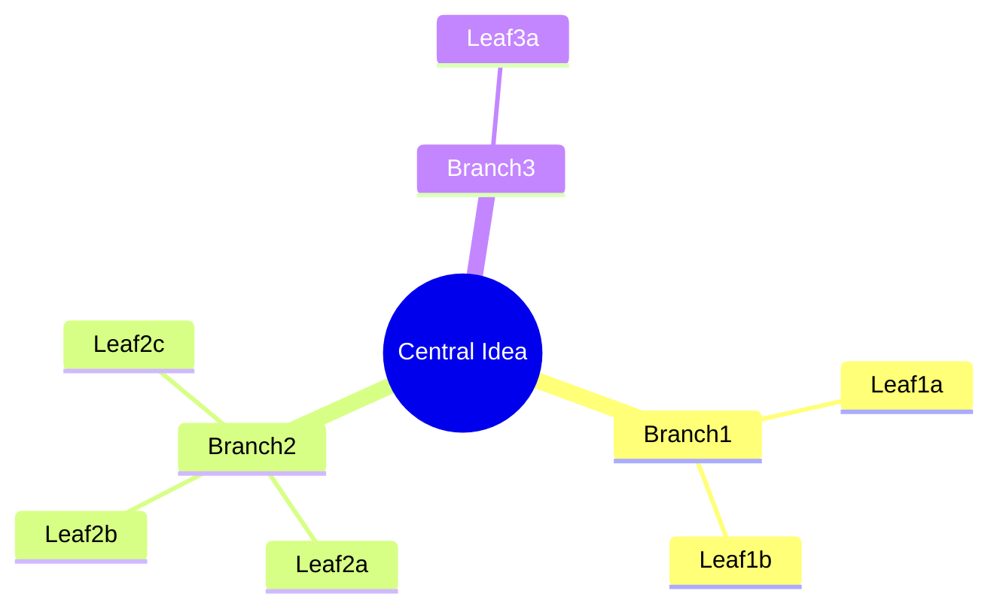
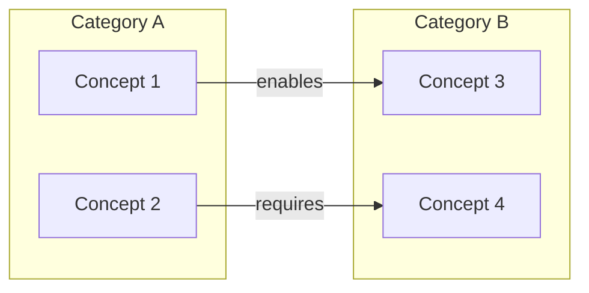
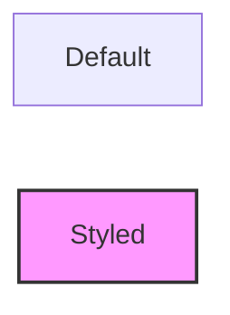
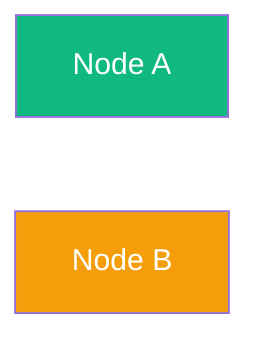
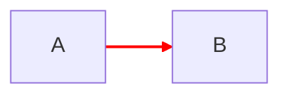

# Mermaid Tool

Renders simple visualizations using Mermaid text-based diagram syntax.

## Overview

Mermaid is a lightweight alternative to HTML for simple diagrams. Write text, get diagrams.

**Use when:**
- Quick, simple diagram needed
- Output will embed in markdown documentation
- Diagram has < 10 elements
- Minimal interactivity is acceptable

**Don't use when:**
- Complex layout required
- Interactivity (expand/collapse, zoom) needed
- Fine-grained styling control required
- Concept maps with many cross-connections

## Supported Techniques

| Technique | Mermaid Support | Notes |
|-----------|-----------------|-------|
| Flow | Excellent | Primary use case |
| Hierarchy | Good | Use graph TD |
| Timeline | Good | Use timeline syntax |
| Concept Map | Limited | Cross-connections difficult |
| Mind Map | Limited | Use mindmap syntax (newer) |
| Matrix | Not supported | Use HTML |
| Fishbone | Not supported | Use HTML |

## Output Format

Mermaid code in a markdown code block:

````markdown

````

## Syntax Reference

### Flow Diagrams

**Direction options:**
- `TB` or `TD`: Top to bottom
- `BT`: Bottom to top
- `LR`: Left to right
- `RL`: Right to left

**Node shapes:**


**Connection types:**
```mermaid
graph LR
    A --> B  %% Arrow
    A --- B  %% Line
    A -.-> B %% Dotted arrow
    A ==> B  %% Thick arrow
    A -->|label| B %% Labeled
```

**Example flow:**


### Hierarchy (as Graph)



### Timeline



### Mind Map (newer syntax)



### Concept Map (limited)

Use subgraphs for grouping, but cross-connections become messy:



## Styling in Mermaid

**Node styling:**


**Class-based styling:**


**Link styling:**


## Limitations

**No interactivity:** Mermaid diagrams are static. No expand/collapse, no hover details, no zoom.

**Limited layout control:** Mermaid auto-layouts. You can't precisely position elements.

**Complex diagrams break:** More than 15-20 nodes with many connections becomes unreadable.

**Concept maps difficult:** Cross-connections create visual chaos. Use HTML for true concept maps.

**No matrix support:** 2x2 matrices and comparison tables require HTML.

**No fishbone support:** The fishbone structure isn't a native Mermaid diagram type.

## When to Recommend HTML Instead

If any of these apply, use HTML tool:
- User needs interactivity
- Diagram has > 15 elements
- Layout precision matters
- Technique is Matrix or Fishbone
- Concept map has many cross-connections
- Fine-grained styling required

## Rendering

Mermaid diagrams render in:
- GitHub markdown
- GitLab markdown
- Notion
- Obsidian
- VS Code with Mermaid extension
- Any markdown renderer with Mermaid support

For standalone use, wrap in HTML:

```html
<!DOCTYPE html>
<html>
<head>
    <script src="https://cdn.jsdelivr.net/npm/mermaid/dist/mermaid.min.js"></script>
</head>
<body>
    <div class="mermaid">
        graph TD
            A --> B
    </div>
    <script>mermaid.initialize({startOnLoad: true});</script>
</body>
</html>
```

## Troubleshooting

**Diagram not rendering:** Check syntax carefully. Missing arrows or brackets break parsing.

**Layout is wrong:** Mermaid auto-layouts. Try changing direction (TD vs LR) or restructuring connections.

**Labels cut off:** Keep labels short. Long text breaks layout.

**Colors not showing:** Verify style/classDef syntax is correct.

